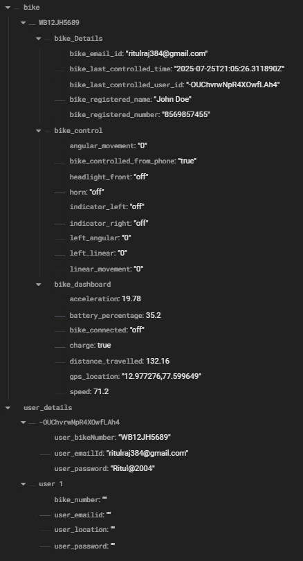

# Vikrant – The Smart E-Bike 🚴‍♂️⚡

An IoT-powered smart e-bike control and monitoring system built for the **SIEP E-Bike Challenge**.  
It combines embedded hardware, cloud-based services, and a user dashboard for **real-time tracking, analytics, and control**.

---

## 📌 Features

- **Smart Bike Control**  
  Control essential functions via connected hardware (ESP32, sensors, actuators).

- **Live Data Dashboard**  
  Displays key metrics like battery status, speed, and GPS location.

- **Mobile App Integration**  
  Flutter-based mobile app for controlling the bike and viewing live data.

- **Secure Communication**  
  Uses Firebase + MQTT for real-time, reliable data sync.

- **Modular Codebase**  
  Separate scripts for device control, dashboard data handling, and mobile UI.

---

## 📂 Repository Structure

```
Vikrant_The_bike/
│
├── bike_control.py           # Handles sensor logic and bike control operations
├── dashboard_sensor_data.py  # Fetches and processes dashboard data from sensors
├── Database_Structure.png    # Database diagram for data model and relationships
├── vikrant/                  # Flutter mobile app for bike control and monitoring
│   ├── lib/                  # Main Dart source files
│   ├── pubspec.yaml          # Flutter dependencies
│   ├── android/ ios/         # Platform-specific configurations
└── (More files to be added in future updates)
```

---

## 🛠️ Tech Stack

- **Hardware:** ESP32, sensors, actuators  
- **Backend:** Firebase (Real-time Database), MQTT broker  
- **Languages:** Python, Embedded C, Dart  
- **Mobile:** Flutter framework  
- **Cloud Integration:** Firebase SDK for Python & Flutter

---

## ⚙️ Setup Instructions

### 1️⃣ Clone the Repository
```bash
git clone https://github.com/Chikkkuuu/Vikrant_The_bike.git
cd Vikrant_The_bike
```

### 2️⃣ Python Backend Setup
```bash
pip install firebase-admin paho-mqtt
```
- Create a Firebase project in the [Firebase Console](https://console.firebase.google.com/).
- Generate and download the **serviceAccountKey.json** file.
- Place it in the project root directory.

**Run the scripts:**
- **For bike control:**
```bash
python bike_control.py
```
- **For dashboard sensor data:**
```bash
python dashboard_sensor_data.py
```

---

## 📱 Mobile App Setup (Flutter)

The `vikrant/` folder contains the **Flutter app** for controlling and monitoring the bike in real-time.

**Steps:**
1. Install [Flutter](https://flutter.dev/docs/get-started/install) on your system.  
2. Navigate to the app folder:
   ```bash
   cd vikrant
   ```
3. Install dependencies:
   ```bash
   flutter pub get
   ```
4. Connect a mobile device or start an emulator.
5. Run the app:
   ```bash
   flutter run
   ```
6. Ensure the Firebase configuration in the app matches the backend configuration for the bike.

---

## 📊 Database Structure



---

## 🤝 Contributing

We welcome contributions!  
- Fork the repository  
- Create a new branch (`feature/new-feature`)  
- Commit your changes  
- Submit a pull request

---

## 📌 Roadmap

- Add complete hardware connection diagrams  
- Integrate advanced analytics for performance tracking  
- Improve power efficiency  
- Add offline mode with data sync on reconnect

---

## 📄 License
This project is open-source under the MIT License.

---

**Developed by:** Ritul Raj Bhakat  
📧 Email: ritulraj384@gmail.com  
🔗 LinkedIn: https://www.linkedin.com/in/ritul-raj-bhakat-521202277/  
🔗 GitHub: https://github.com/Chikkkuuu
